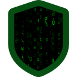
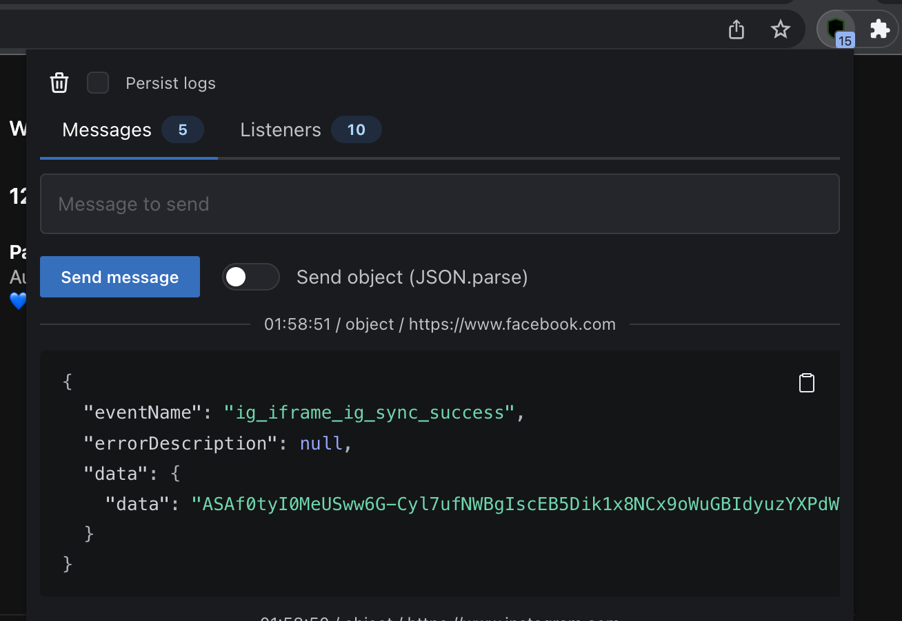

## Site Check Helper

This extension checks some points on the site:
1. Display events from the [postMessage API](https://developer.mozilla.org/en-US/docs/Web/API/Window/postMessage)
   * You can copy and send modified events
2. Display listeners in code `window.addEventListener('message', () => { ... })`

## Run locally
1. `git clone git@github.com:gromadchuk/site-check-helper.git`
2. `cd site-check-helper`
3. `npm install`
4. `npm run dev`
5. Open `chrome://extensions/` and enable `Developer mode`
6. Click `Load unpacked` and select `site-check-helper/build` folder